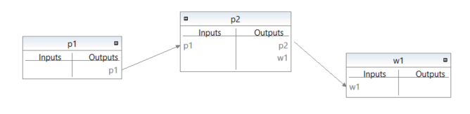

# minil
`minil` is a minimalistic language for describing test LCI models. It can be
converted to the [openLCA JSON-LD format](https://github.com/GreenDelta/olca-schema)
or to [Julia](https://julialang.org/) script using the `minil` command line tool:

```bash
$ minil <file>
```

This will read the given `file` and produce a zip file that can be imported into
[openLCA](http://www.openlca.org/). To produce a Julia script, you can append
the `--julia` flag:

```bash
$ minil <file> --julia
```


## Syntax
`minil` looks like this:

```r
# a simple example
p1 -> 2.2 e1
p2 <- 0.5 p1
p2 -> 0.8 w1
w1 <- 1.2 r1
w1 <- 2.0 w1
w1 -> 3.4 e1
```

It just describes the input and output relations of flows. Flows have an
identifier like `p1` where the first character should be a letter followed
by any character except whitespaces:

```ebnf
Identifier = Letter, {Character - Whitespace}
```

`minil` knows three types of flows: products, wastes, and elementary flows. The
flow type is identified by the first letter of an identifier. Identifiers that
start with the letter `p` (or `P`) are recognized as product flows (e.g. `p1`).
When the first letter is a `w` (or `W`) it is recognized as a waste flow
(e.g. `w1`). All other identifiers are recognized as elementary flows
(e.g. `e1` or `r1`).

```ebnf
ProductIdentifier = "p" | "P", {Character - Whitespace}
```

```ebnf
WasteIdentifier   = "w" | "W", {Character - Whitespace}
```

Each line in a `minil` file describes an input or output relation. An input
relation has the following syntax:

```ebnf
Input = ProductIdentifier | WasteIdentifier, "<-", Number, Identifier
```

For example, `w1 <- 1.2 r1` describes an input of `1.2` units of the elementary
flow `r1` for the treatment of the waste flow `w1`. Correspondingly, an output
relation has the following syntax:

```ebnf
Output = ProductIdentifier | WasteIdentifier, "->", Number, Identifier
```

The line `p2 -> 0.8 w1` describes an output of `0.8` units of the waste flow 
`w1` related to the product flow `p2`. Finally, each line that starts with a
`#` is a comment.

```ebnf
Comment = "#", {Character}
```


## Conversion
For each product and waste flow a corresponding process with the same identifier
is created. For product flows, an output and for waste flows an input is added
as reference flow to that process. By default the amount of this reference
flow is set to `1.0` but it can be set to another value via an input or
output relation, e.g. the following sets the amount of the reference flow to
`2.0` units `w1`:

```r
w1 <- 2.0 w1
```

In the resulting JSON-LD package the units of all inputs and outputs are set
to kilogram mass using the UUIDs from the openLCA reference data. The converted
example above looks like the following in openLCA:



When converting into a Julia script (via the `--julia` flag), the input and
output relations are translated to standard LCI matrices. The example above
will be translated to the following code:

```julia
# ref is the index of the reference flow
# of the product system; 1 is the default value
ref = 1

# the technology matrix
A = [
     1.00  -0.50   0.00  ;  # p1
     0.00   1.00   0.00  ;  # p2
     0.00   0.80  -2.00  ;  # w1
]
println("\n\nA = ")
display(A)

# the intervention matrix
B = [
     2.20   0.00   3.40  ;  # e1
     0.00   0.00  -1.20  ;  # r1
]
println("\n\nB = ")
display(B)

# the final demand
f = zeros(size(A)[1])
f[ref] = 1.0
println("\n\nf = ")
display(f)

# the scaling vector
s = A \ f
println("\n\ns = ")
display(s)

# the LCI result
g = B * s
println("\n\ng = ")
display(g)
```

Changing the reference flow to `ref = 2` in this script and running it with
the Julia interpreter should give the following inventory result:

```julia
g = [
  2.46 ; # e1
 -0.48 ; # r1
]
```

## Building from source
This is a simple Go project with dependencies to `github.com/google/uuid`
and `github.com/msrocka/ld`. You can build and test it with the following steps
when you have Go installed:

```bash
git clone https://github.com/msrocka/minil.git
cd minil
go get github.com/google/uuid
go get github.com/msrocka/ld
go build
minil example.minil
```
